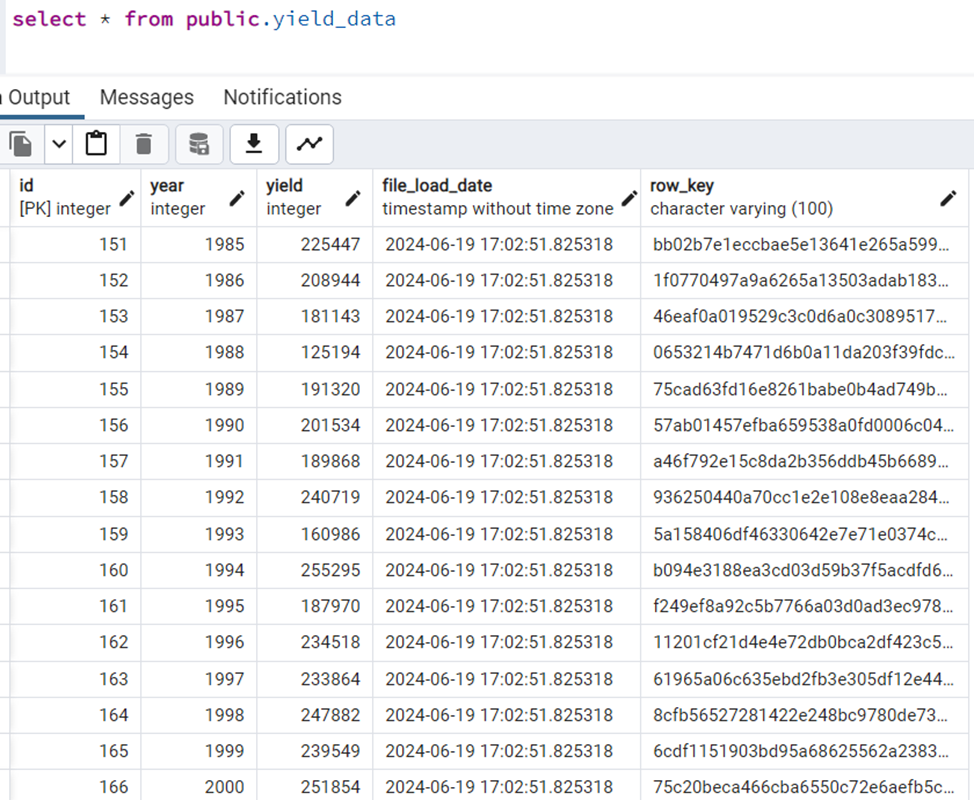
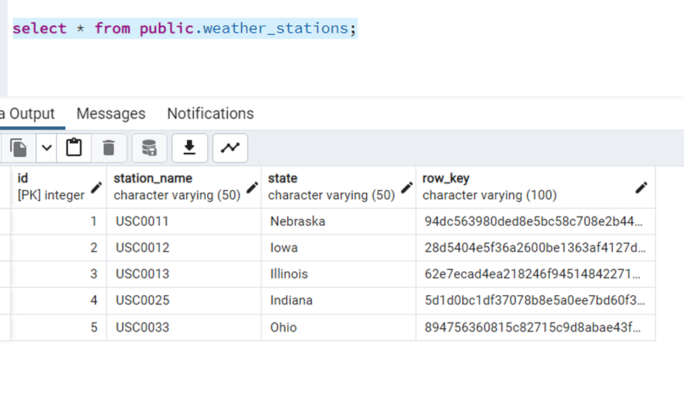
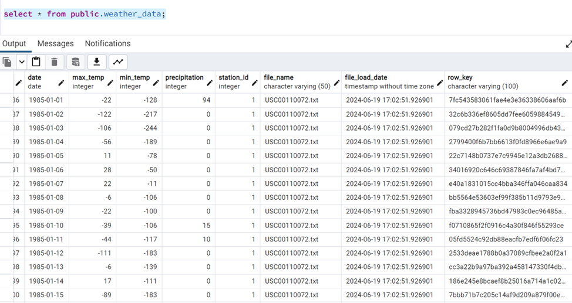
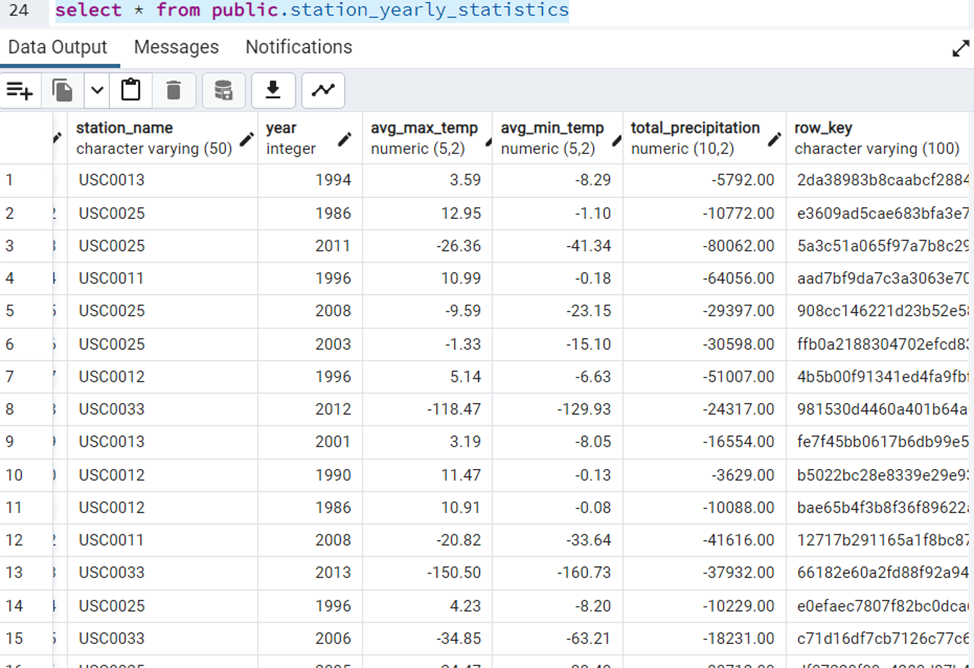

# Weather-API
# Assumptions

Assumption #1
Based on file name, I have considered that below codes means station names. codes are derived from file names shared 
("USC0011", "Nebraska"),
("USC0012", "Iowa"),
("USC0013", "Illinois"),
("USC0025", "Indiana"),
("USC0033", "Ohio")

Assumption #2 an extra unique row_key of MD5 encryption is added to each table, it will act as unique key
there will be no chance of having duplicate data in the table


# Weather API

This is a Flask-based Weather API that provides endpoints for weather data and yearly statistics.

## Setup
cd weather_api
1. Install dependencies:
    ```sh
    pip install -r requirements.txt
    ```

2. Set up the database:

python database\create\Create_tables.py
python database\ingest\load_data.py
``` data has been loaded till here ``

``` now create the statistics table as data mart```
python weather_api\database\data_mart\create\create_statistics_table.py
python weather_api\database\data_mart\ingest\data_analysis.py


3. Run the application:
    ```sh
    python app.py
    ```

4. Run the tests:
    ```sh
    python tests/test_app.py
    ```

     
     
     
     
Output – 
127.0.0.1:5000/api/weather/stats

```
{
    "data": [
        {
            "avg_max_temp": "3.59",
            "avg_min_temp": "-8.29",
            "row_key": "2da38983b8caabcf288483eaefe8e9c0",
            "station_name": "USC0013",
            "total_precipitation": "-5792.00",
            "year": 1994
        },
        {
            "avg_max_temp": "12.95",
            "avg_min_temp": "-1.10",
            "row_key": "e3609ad5cae683bfa3e73ed54b2aea50",
            "station_name": "USC0025",
            "total_precipitation": "-10772.00",
            "year": 1986
        },
        {
            "avg_max_temp": "-26.36",
            "avg_min_temp": "-41.34",
            "row_key": "5a3c51a065f97a7b8c2945d451142b33",
            "station_name": "USC0025",
            "total_precipitation": "-80062.00",
            "year": 2011
        },
        {
            "avg_max_temp": "10.99",
            "avg_min_temp": "-0.18",
            "row_key": "aad7bf9da7c3a3063e70c0620b67f720",
            "station_name": "USC0011",
            "total_precipitation": "-64056.00",
            "year": 1996
        },
        {
            "avg_max_temp": "-9.59",
            "avg_min_temp": "-23.15",
            "row_key": "908cc146221d23b52e5890fb4a7bc3a0",
            "station_name": "USC0025",
            "total_precipitation": "-29397.00",
            "year": 2008
        },
        {
            "avg_max_temp": "-1.33",
            "avg_min_temp": "-15.10",
            "row_key": "ffb0a2188304702efcd83267c34c3a5b",
            "station_name": "USC0025",
            "total_precipitation": "-30598.00",
            "year": 2003
        },
        {
            "avg_max_temp": "5.14",
            "avg_min_temp": "-6.63",
            "row_key": "4b5b00f91341ed4fa9fbf610886d2d4b",
            "station_name": "USC0012",
            "total_precipitation": "-51007.00",
            "year": 1996
        },
        {
            "avg_max_temp": "-118.47",
            "avg_min_temp": "-129.93",
            "row_key": "981530d4460a401b64a0d6190fc74f16",
            "station_name": "USC0033",
            "total_precipitation": "-24317.00",
            "year": 2012
        },
        {
            "avg_max_temp": "3.19",
            "avg_min_temp": "-8.05",
            "row_key": "fe7f45bb0617b6db99e51b1fc7bcfeb9",
            "station_name": "USC0013",
            "total_precipitation": "-16554.00",
            "year": 2001
        },
        {
            "avg_max_temp": "11.47",
            "avg_min_temp": "-0.13",
            "row_key": "b5022bc28e8339e29e93da8b79c2b197",
            "station_name": "USC0012",
            "total_precipitation": "-3629.00",
            "year": 1990
        }
    ],
    "page": 1,
    "pages": 15,
    "per_page": 10,
    "total": 150
}

127.0.0.1:5000/api/weather

{
    "data": [
        {
            "date": "1985-01-01",
            "file_load_date": "2024-06-19T17:02:51.926901",
            "file_name": "USC00110072.txt",
            "max_temp": -22,
            "min_temp": -128,
            "precipitation": 94,
            "station_id": 1
        },
        {
            "date": "1985-01-02",
            "file_load_date": "2024-06-19T17:02:51.926901",
            "file_name": "USC00110072.txt",
            "max_temp": -122,
            "min_temp": -217,
            "precipitation": 0,
            "station_id": 1
        },
        {
            "date": "1985-01-03",
            "file_load_date": "2024-06-19T17:02:51.926901",
            "file_name": "USC00110072.txt",
            "max_temp": -106,
            "min_temp": -244,
            "precipitation": 0,
            "station_id": 1
        },
        {
            "date": "1985-01-04",
            "file_load_date": "2024-06-19T17:02:51.926901",
            "file_name": "USC00110072.txt",
            "max_temp": -56,
            "min_temp": -189,
            "precipitation": 0,
            "station_id": 1
        },
        {
            "date": "1985-01-05",
            "file_load_date": "2024-06-19T17:02:51.926901",
            "file_name": "USC00110072.txt",
            "max_temp": 11,
            "min_temp": -78,
            "precipitation": 0,
            "station_id": 1
        },
        {
            "date": "1985-01-06",
            "file_load_date": "2024-06-19T17:02:51.926901",
            "file_name": "USC00110072.txt",
            "max_temp": 28,
            "min_temp": -50,
            "precipitation": 0,
            "station_id": 1
        },
        {
            "date": "1985-01-07",
            "file_load_date": "2024-06-19T17:02:51.926901",
            "file_name": "USC00110072.txt",
            "max_temp": 22,
            "min_temp": -11,
            "precipitation": 0,
            "station_id": 1
        },
        {
            "date": "1985-01-08",
            "file_load_date": "2024-06-19T17:02:51.926901",
            "file_name": "USC00110072.txt",
            "max_temp": -6,
            "min_temp": -106,
            "precipitation": 0,
            "station_id": 1
        },
        {
            "date": "1985-01-09",
            "file_load_date": "2024-06-19T17:02:51.926901",
            "file_name": "USC00110072.txt",
            "max_temp": -22,
            "min_temp": -100,
            "precipitation": 0,
            "station_id": 1
        },
        {
            "date": "1985-01-10",
            "file_load_date": "2024-06-19T17:02:51.926901",
            "file_name": "USC00110072.txt",
            "max_temp": -39,
            "min_temp": -106,
            "precipitation": 15,
            "station_id": 1
        }
    ],
    "page": 1,
    "pages": 172996,
    "per_page": 10,
    "total": 1729957
}
```

Steps for Deployment on AWS

High-Level AWS Architecture

1.	AWS EC2 or AWS Lambda: For hosting Flask application.
2.	Amazon RDS: For the PostgreSQL database.
3.	Amazon S3: For storing static files
4.	Amazon API Gateway: For managing the API endpoints.
5.	Amazon CloudWatch: For logging and monitoring.
6.	Amazon IAM: For managing roles and permissions.

Step-by-Step Guide

1. Login to AWS
2. Setting Up Amazon RDS
    •	Create an RDS Instance:
    •	Go to the RDS service in the AWS Management Console.
    •	Choose the PostgreSQL engine.
    •	Configure the instance details (e.g., instance size, VPC, security groups).
    •	Set the database name, username, and password.
    •	Configure Security Groups: Ensure that the security group allows traffic from your EC2 instance or wherever your application will be hosted.
3. Setting Up the Flask Application
    •	Flask application to use the RDS PostgreSQL instance.
4. Deploying the Application
    You have two main options: deploying on an EC2 instance or using AWS Lambda with API Gateway.
    Deploy on AWS EC2
    •	Launch an EC2 Instance:
    •	Choose an appropriate instance type.
    •	Configure the instance (security groups, key pairs, etc.).
    •	SSH into the Instance:
    •	Install required software (Python, pip, Flask, etc.).
    •	Install and configure your application dependencies.
    •	Run the Flask application using a WSGI server (like Gunicorn).
    Example setup commands:
    sh
    Copy code
    sudo yum update -y
    sudo yum install python3 -y
    python3 -m venv myenv
    source myenv/bin/activate
    pip install flask flask_sqlalchemy gunicorn
    gunicorn --bind 0.0.0.0:5000 app:app

    •	Configure Security Groups: Ensure that the security group allows HTTP/HTTPS traffic on the required ports (e.g., port 5000).
5. Storing Static Files 
    •	Setup Amazon S3: Create an S3 bucket for storing static files.
    •	Configure Flask to Use S3
6. Monitoring and Logging
    •	Setup Amazon CloudWatch:
    •	Configure CloudWatch logs to monitor the application and database.
    •	Set up alarms and dashboards for key metrics.
7. Security and Permissions
    •	Configure IAM Roles: Ensure that EC2 instance or Lambda function has the necessary IAM roles to access RDS, S3, and other AWS services.


## Endpoints

- `GET /api/weather`: Get weather data with pagination and filtering options.
- `GET /api/weather/stats`: Get yearly weather statistics with pagination and filtering options.

http://127.0.0.1:5000/api/weather - weather info
http://127.0.0.1:5000/api/weather/stats - weather stats
## Swagger UI

Access the Swagger UI documentation at `http://localhost:5000/swagger`.
